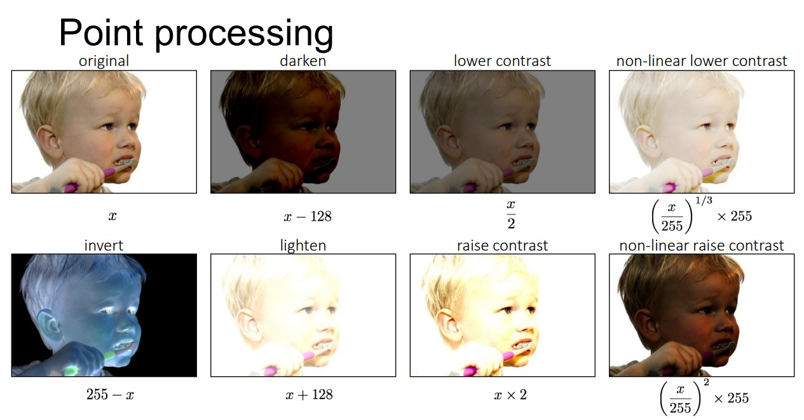
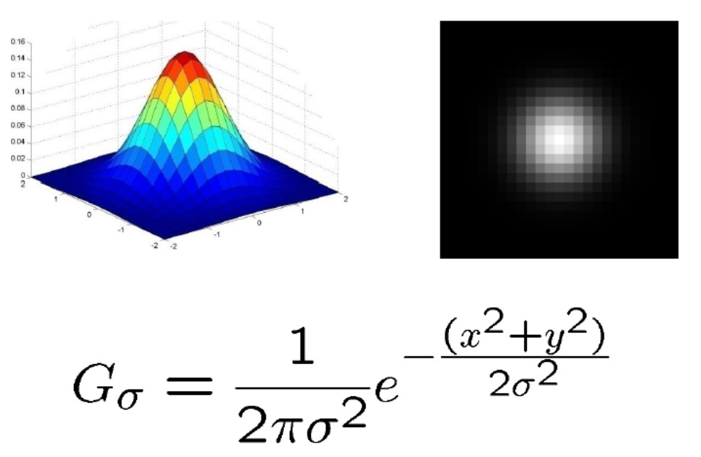
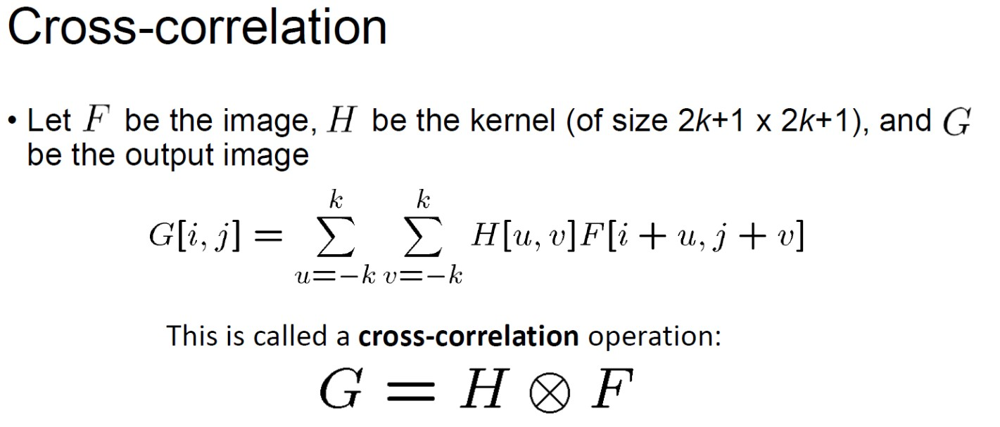
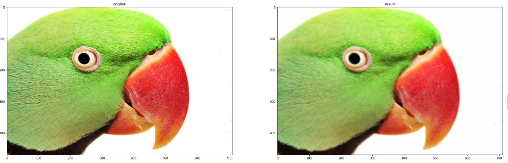
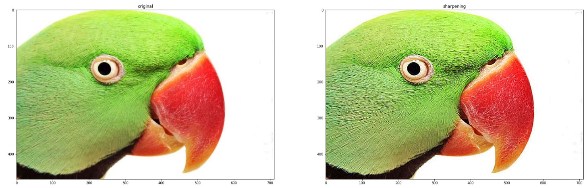
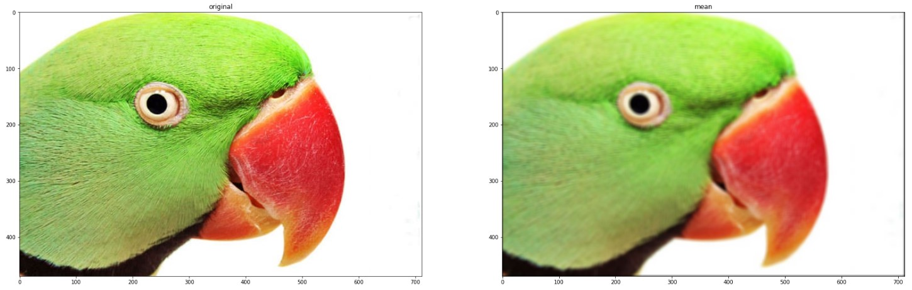
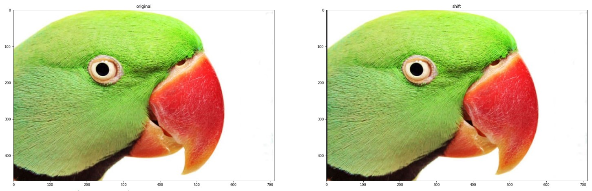
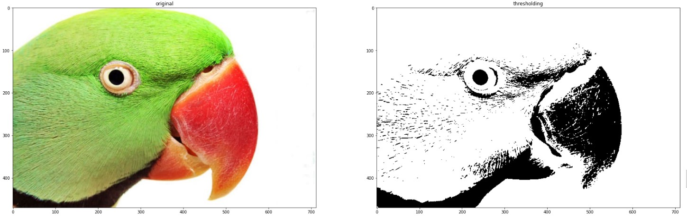
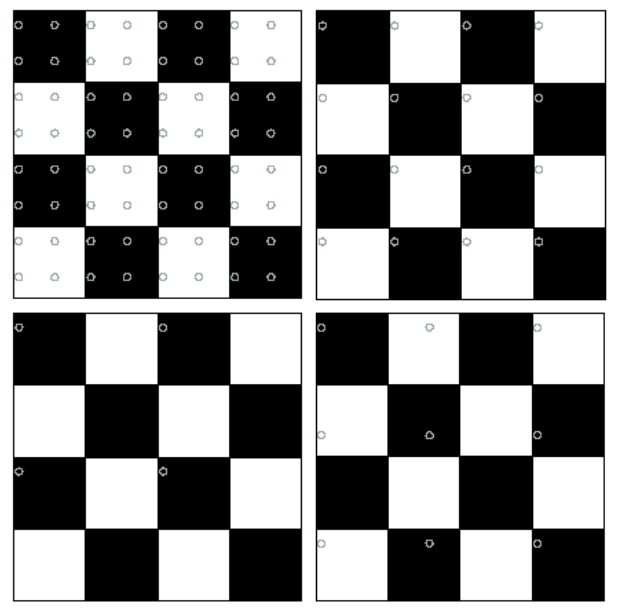
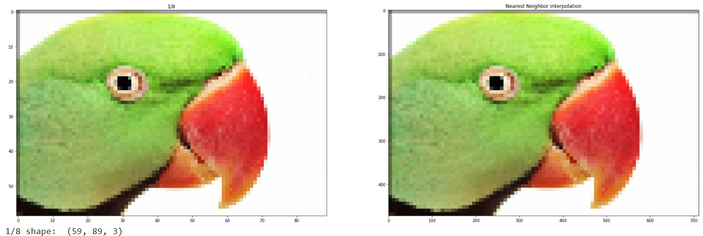

# Artifical Intelligence in Digital Signal Analysis and its Applications HW1

## Image point processing

## Filter an Image (Gaussion)
### Step1 : Get filter kernel

### Step 2 : Padding
### Step 3 : Convolution

### Result

## Filtering an Image (Sharpening)
### Result

## Filtering an Image (Mean)
### Result

## Filtering an Image (Shift)
### Result

## Filtering an Image (Thresholding)
### Result

## Downsampling

## Upsampling

